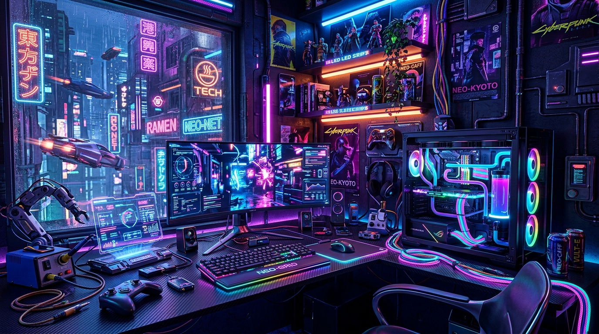

  

<h1 align="center">Hi there, I'm Kushu Shukla 🚀</h1>

  

  

  
  
  

---

### 🧠 About Me

<table>
  <tr>
    <td valign="top" width="60%">
      I am a <strong>B.Tech Graduate (CSE - AIML)</strong> who loves diving into code, exploring bleeding-edge tech, and building highly intelligent projects.  
      <ul>
        <li>🔭 Working with <strong>Deep Learning, NLP, and Computer Vision</strong>.</li>
        <li>🚀 Building scalable solutions with <strong>Python, Django, and real-time applications</strong>.</li>
        <li>🌱 Currently learning and mastering <strong>DSA and Advanced ML Algorithms</strong>.</li>
        <li>🤝 Open to collaborations on <strong>AI, ML, and Web projects</strong>.</li>
        <li>⚡ Fun Fact: I'm always eager to dive into massive datasets and turn them into actionable insights!</li>
      </ul>
    </td>
    <td valign="top" width="40%" align="center">
      
    </td>
  </tr>
</table>

---

### 🏆 Featured Projects

  <table>
    <tr>
      <td width="50%" align="center">
        
      </td>
      <td width="50%" align="center">
        
      </td>
    </tr>
  </table>

---

### 🛠️ Technical Arsenal

<table>
  <tr>
    <td valign="top" width="40%" align="center">
      
    </td>
    <td valign="top" width="60%">
      <b>Languages</b> 
      
      
      
      
        
      <b>Machine Learning & Data Science</b> 
      
      
      
      
      
        
      <b>Frameworks & Web</b> 
      
      
      
      
        
      <b>Cloud & Tools</b> 
      
      
      
    </td>
  </tr>
</table>

---

### 📊 GitHub Analytics

  
  

 

  

 

  <picture>
    <source media="(prefers-color-scheme: dark)" srcset="https://raw.githubusercontent.com/Kushu-Shukla/Kushu-Shukla/output/github-contribution-grid-snake-dark.svg">
    <source media="(prefers-color-scheme: light)" srcset="https://raw.githubusercontent.com/Kushu-Shukla/Kushu-Shukla/output/github-contribution-grid-snake.svg">
    
  </picture>

  

