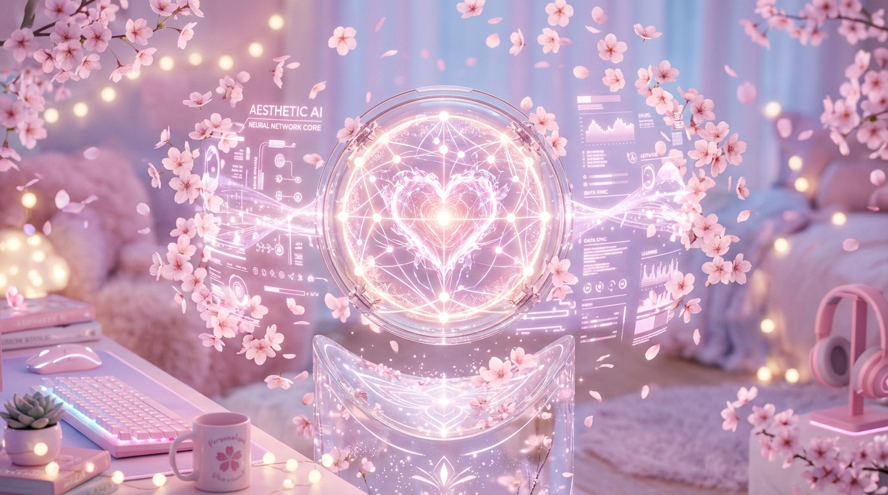

  

<h1 align="center">Hi there, I'm Kushu Shukla 🌸✨</h1>

  

  

  
  
  

---

### 💖 About Me

<table>
  <tr>
    <td valign="top" width="60%">
      I am a <strong>B.Tech Graduate (CSE - AIML) 👩🏻‍🎓</strong> who loves coding, exploring new technologies, and building intelligent projects with a touch of magic.  
      <ul>
        <li>🎀 Working with <strong>Deep Learning, NLP, and Computer Vision</strong>.</li>
        <li>✨ Building scalable solutions with <strong>Python, Django, and real-time applications</strong>.</li>
        <li>🌸 Currently exploring <strong>Advanced ML Algorithms & Generative AI</strong>.</li>
        <li>🤝 Open to collaborations on <strong>AI, ML, and Web projects</strong>.</li>
        <li>💫 Fun Fact: I'm always eager to dive into complex datasets and turn them into actionable insights!</li>
      </ul>
    </td>
    <td valign="top" width="40%" align="center">
      
    </td>
  </tr>
</table>

---

### 🏆 Featured Projects

  <table>
    <tr>
      <td width="50%" align="center">
        
      </td>
      <td width="50%" align="center">
        
      </td>
    </tr>
  </table>

---

### 🛠️ Technical Arsenal

**Languages** 

 

**Machine Learning & Data Science** 

 

**Frameworks & Web** 

 

**Cloud & Tools** 

---

### 📊 GitHub Analytics

  
  

 

  

 

  <picture>
    <source media="(prefers-color-scheme: dark)" srcset="https://raw.githubusercontent.com/Kushu-Shukla/Kushu-Shukla/output/github-contribution-grid-snake-dark.svg">
    <source media="(prefers-color-scheme: light)" srcset="https://raw.githubusercontent.com/Kushu-Shukla/Kushu-Shukla/output/github-contribution-grid-snake.svg">
    
  </picture>

  

